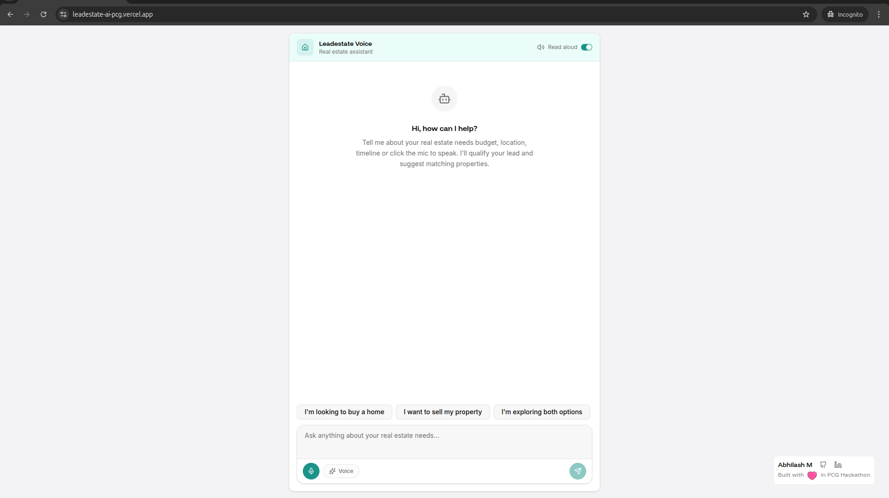
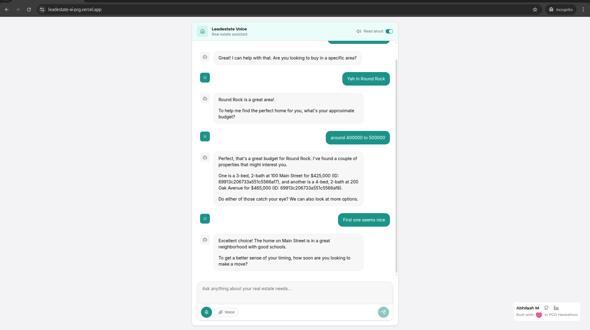
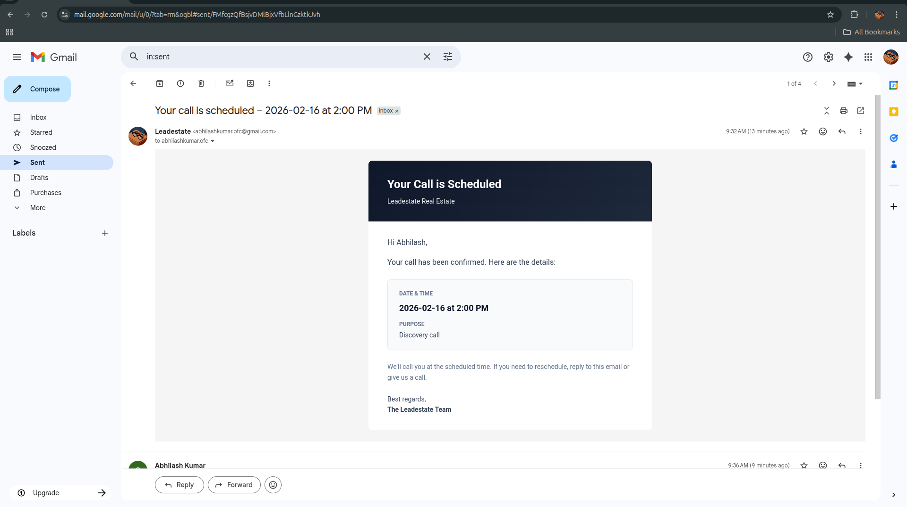
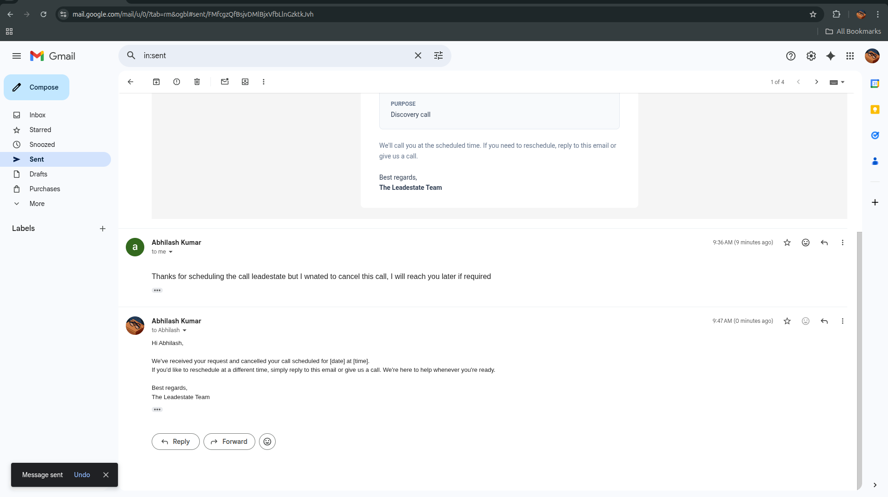
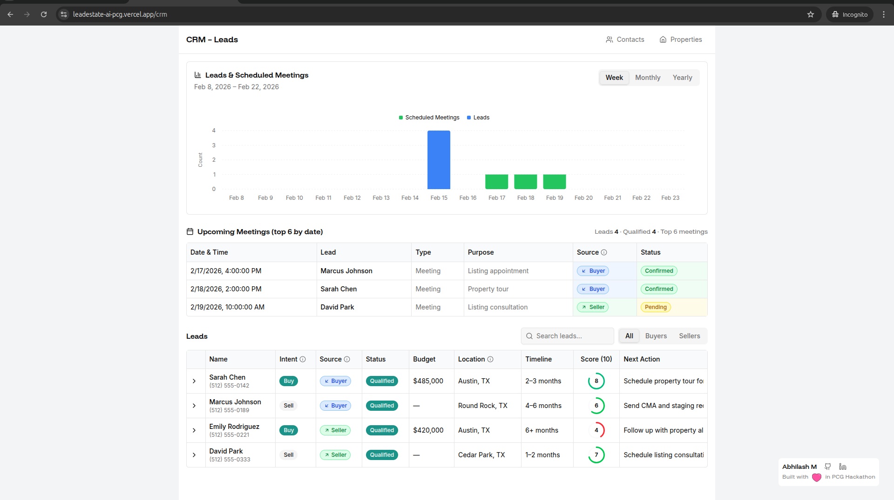
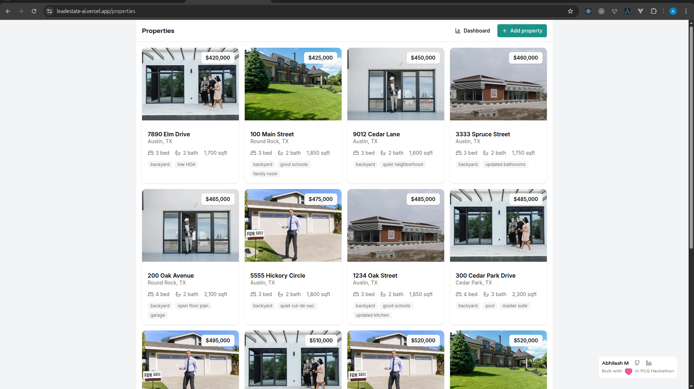
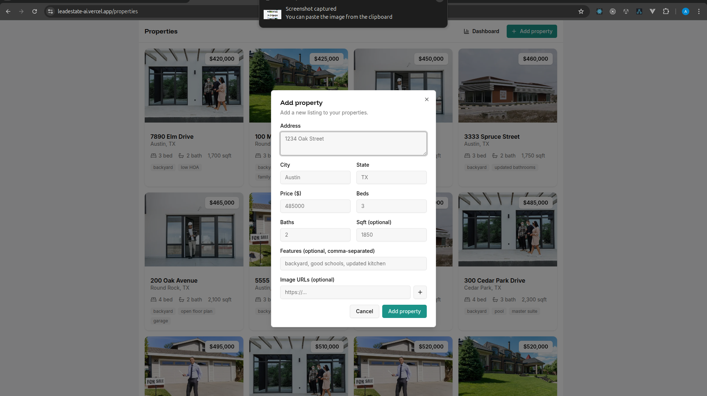
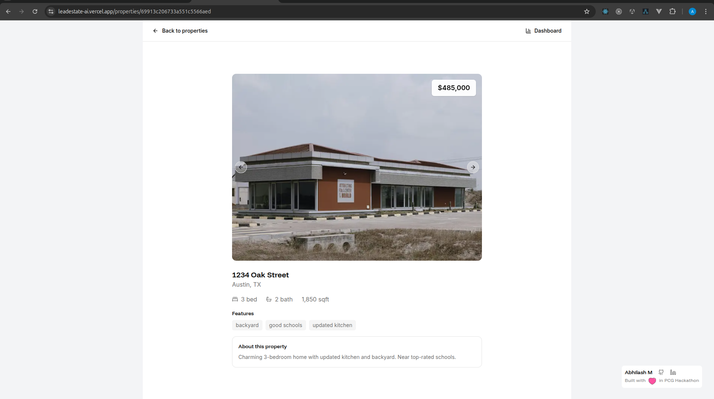
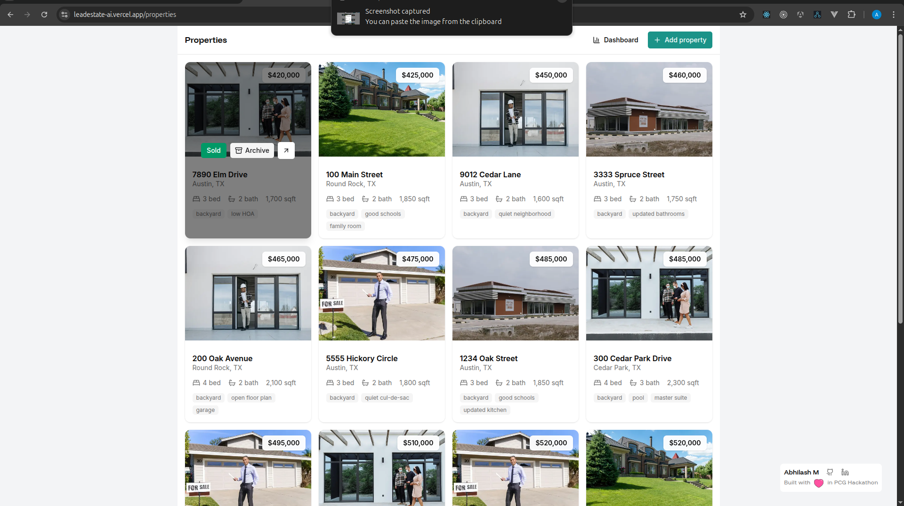

# Leadestate Voice

AI-powered inbound/outbound agent for US real estate. Handles buyer and seller inquiries, qualifies leads, schedules calls, sends confirmation emails, and processes cancellation replies automatically.

**Live demo:** [Conversation chatbot](https://leadestate-ai.vercel.app/) · [CRM dashboard](https://leadestate-ai.vercel.app/crm)

---

## Quick Start

```bash
npm install
cp .env.example .env   # Create .env from template
# Edit .env and set your variables (see Environment Variables below)
npm run dev
```

Open [http://localhost:3000](http://localhost:3000) for the voice chat.

### Environment Setup

Copy `.env.example` to create your `.env` file. The example file lists all required and optional variables with placeholder values. Replace them with your actual credentials:

```bash
cp .env.example .env
```

Then edit `.env` and set your values (API keys, database URL, email credentials, etc.). Never commit `.env` to version control—it is gitignored.

---

## Email Flow

The system sends meeting confirmation emails and automatically handles cancellation replies.

### 1. Schedule a Call (Voice Chat)

Users qualify through the AI voice chat, provide contact details, and confirm a time slot. The AI collects name, phone, and **email** (required) before scheduling.



### 2. Conversation & Scheduling

The AI proposes available slots and confirms the booking. Once the user confirms, the system creates the schedule and sends a confirmation email.



### 3. Confirmation Email Sent

A styled HTML email is sent to the customer with the meeting details. The email includes threading headers so replies stay in the same thread.



**Example confirmation email:**

| Field       | Content                                                                                             |
| ----------- | --------------------------------------------------------------------------------------------------- |
| **Subject** | Your call is scheduled – [date] at [time]                                                           |
| **Body**    | Lead name, date, time, purpose. "If you need to reschedule, reply to this email or give us a call." |

### 4. Customer Replies to Cancel

If the customer replies with cancellation intent (e.g. "I wanted to cancel this call, I will reach you later"), the system:

1. **Detects intent** – AI classifies the reply as `cancel`, `reschedule`, or `other`
2. **Cancels the schedule** – Updates status in the database
3. **Updates the CRM** – Removes the appointment, sets next action, adds a note
4. **Sends a threaded reply** – Confirms the cancellation and offers to reschedule



**Example cancellation reply:**

| Field       | Content                                                                                                                                                                              |
| ----------- | ------------------------------------------------------------------------------------------------------------------------------------------------------------------------------------ |
| **Subject** | Re: Your call is scheduled – [date] at [time]                                                                                                                                        |
| **Body**    | "We've received your request and cancelled your call scheduled for [date] at [time]. If you'd like to reschedule at a different time, simply reply to this email or give us a call." |

### Email Observer (Cron)

The email observer runs periodically (every 10 minutes on Vercel, or via `npm run email-observer`) to:

- Connect to IMAP inbox
- Fetch unseen emails that reply to our meeting confirmations
- Classify intent with AI
- Execute the cancel flow when appropriate

---

## CRM Dashboard

View leads, meetings, and next actions. Expand rows for full qualification details and suggested properties.



---

## Properties

### Properties List

Grid layout with hover actions: view details, mark as Sold, Archive, or Mark active.



### Add Property

Add new listings with address, city, state, price, beds, baths, and images.



### Property Details

Image carousel, price and status badges, and full listing details.



### Property Actions

Sold, Archive, and Mark active actions for status updates.



---

## Environment Variables

Set variables in `.env`. Use `.env.example` as a template: copy it to `.env` and replace the placeholder values with your own.

| Variable                           | Required        | Description                            |
| ---------------------------------- | --------------- | -------------------------------------- |
| `GOOGLE_GENERATIVE_AI_API_KEY`     | Yes             | Google Gemini API key                  |
| `DATABASE_URL` or `DB_*`           | Yes             | MongoDB connection                     |
| `SMTP_MAIL`                        | For emails      | Sender email (Gmail: use App Password) |
| `SMTP_MAIL_PASSWORD`               | For emails      | SMTP password                          |
| `IMAP_MAIL` / `IMAP_MAIL_PASSWORD` | For cancel flow | Same as SMTP for Gmail                 |
| `CRON_SECRET`                      | Optional        | Protects `/api/cron/email-observer`    |

See `.env.example` for the full list.

---

## Scripts

| Command                  | Description                    |
| ------------------------ | ------------------------------ |
| `npm run dev`            | Start dev server               |
| `npm run build`          | Production build               |
| `npm run start`          | Start production server        |
| `npm run email-observer` | Run IMAP observer (standalone) |

---

## Routes

| Route              | Purpose          |
| ------------------ | ---------------- |
| `/`                | Voice Chat       |
| `/crm`             | CRM Dashboard    |
| `/properties`      | Properties grid  |
| `/properties/[id]` | Property details |
| `/contacts`        | Contacts list    |

---

## Tech Stack

- **Framework:** Next.js 16
- **AI:** Google Gemini (Vercel AI SDK)
- **Database:** MongoDB (Mongoose)
- **Email:** Nodemailer (SMTP), ImapFlow (IMAP)
- **Voice:** Web Speech API
